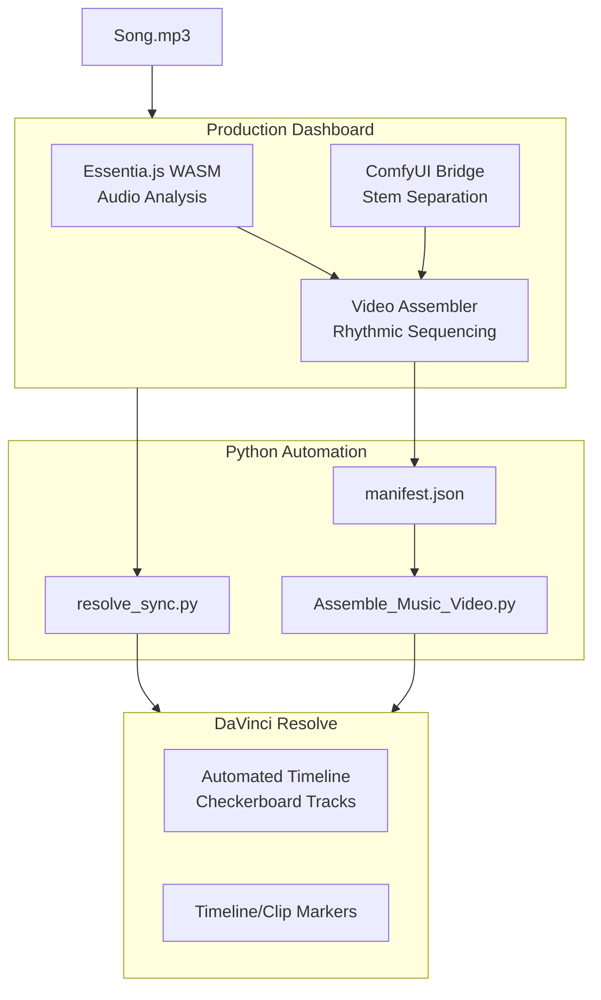

# DaVinci Resolve Tools Dashboard

A modular production tool for DaVinci Resolve featuring **beat synchronization**, **stem separation**, and **marker automation** — powered by **Essentia.js** WASM-based audio analysis.

**GitHub Repository**: [https://github.com/hellonearthis/Resolver](https://github.com/hellonearthis/Resolver)

## Features

- 🎵 **[Beat Extraction](readme_Beat_Detection.md)** — Detect BPM and actual beat positions using Essentia.js
- 🎬 **[Video Assembler](readme_Video_Assembler.md)** — Sync video clips to specific stems (drums, bass) with "Snap to Beat"
- 🎨 **[Storyboard](readme_Storyboard.md)** — Build visual narratives with card-based prompts and AI cinematic expansion.
- 🤖 **[AI Prompt Expansion](vino/README.md)** — NPU-accelerated (Intel Vino) or LM Studio-driven cinematic prompt engineering.
- 🎬 **[Video Sync](readme_Video_Sync.md)** — Auto-sync video clips to the beat
- 📜 **[Script Manager](readme_Script_Manager.md)** — Manage generated Python scripts for Resolve
- 🎚️ **[Stem Separation](readme_Stem_Separation.md)** — Split tracks via ComfyUI with integrated Beat Analysis

### Why Beat Analysis on Stems is a Game Changer
Splitting a track as iconic as "Get Up, Stand Up" into stems—likely Drums, Bass, Vocals, and Other/Guitar—and then running beat analysis on each is a fantastic way to see how the "Wailers' pocket" actually works.

- **The "Push and Pull"**: In reggae, the magic usually happens in the micro-timing. By analyzing stems individually, you can see if the drums are driving the beat while the bass sits slightly "behind" it (creating that heavy, relaxed feel).
- **Syncopation Mapping**: You can visually track how the "bubble" (the organ) or the guitar's "skank" hits the offbeat relative to the kick drum's downbeat.
- **Dynamic Sensitivity**: Standard beat analysis on a full mix often gets confused by the low-end thump. Doing it on a vocal or guitar stem reveals the rhythmic phrasing that isn't tied to the grid.

## Documentation

- 📄 **[Beat Detection Guide](readme_Beat_Detection.md)** – Detailed guide on algorithms, onsets, and loudness.
- 📄 **[Video Assembler Guide](readme_Video_Assembler.md)** – How to use stems, zoom-sync, and checkerboard assembly.
- 📄 **[Storyboard Guide](readme_Storyboard.md)** – Guide to narrative-driven AI generation and storyboarding.
- 📄 **[Video Sync Guide](readme_Video_Sync.md)** – How to sync clips to music.
- 📄 **[Script Manager Guide](readme_Script_Manager.md)** – managing your generated scripts.

## Architecture



## Quick Start

### 1. Install Dependencies

```bash
npm install
```

### 2. Launch the App

```bash
npm start
```
Or run `start-dashboard.bat` on Windows.

---

## DaVinci Resolve Setup

> ⚠️ **Required before running any integrations**

1. Open **DaVinci Resolve** → **Preferences**.
2. Go to **System** → **General**.
3. Set **External Scripting Using** to **Local**.
4. **Restart Resolve**.

### Environment Variables (Windows)
```
PYTHONPATH=%PROGRAMDATA%\Blackmagic Design\DaVinci Resolve\Support\Developer\Scripting\Modules\
```

### Check Your Version
Run the included checker to see if you have Studio (API enabled) or Free version:
```bash
python scripts/check_resolve_version.py
```

## Folder Structure

```
resolver/
├── electron/                  # Electron main process (IPC, window mgmt)
│   ├── main.ts                # Main entry point
│   └── preload.ts             # Context bridge
├── src/                       # React frontend
│   ├── modules/               # Feature-specific modules (BeatExtraction, VideoSync, etc.)
│   ├── components/            # Shared UI components
│   ├── services/              # Logic services (Essentia, etc.)
│   └── hooks/                 # React hooks
├── scripts/                   # Python scripts for DaVinci Resolve integration
│   ├── resolve_sync.py        # Video sync logic
│   ├── beat_marker_loader.py  # Marker import logic
│   └── ...
├── dist-electron/             # Compiled Electron code
└── dist/                      # Compiled React app
```

## Roadmap & Ideas

> 💡 **ComfyUI Workflow Standard**: When designing custom workflows for the application (like LTX Video generation or Stem Separation), ensure that nodes requiring dynamic data injection from the app have their title renamed to include `[input]` (e.g., *LoadAudio [input]*), and nodes generating final results have their title renamed to include `[output]` (e.g., *SaveImage [output]*).

- [x] **Stem Separation**: Integrate ComfyUI to split audio into stems (drums, bass, vocals).
- [x] **Beat Analysis per Stem**: Analyze and visualize individual rhythmic layers.
- [x] **Video Assembler**: Specialized UI for multi-stem rhythmic syncing.
- [x] **Storyboard Module**: Narrative-driven card system with unified AI prompts and versioning.
- [x] **AI Cinematic Expansion**: Tri-tier prompt engineering (Image → Action → LTX) via local NPU or LM Studio.
- [x] **Project Bundle Structure**: Refactor projects to be self-contained bundles.
- [ ] **Tap Tempo**: Manual BPM adjustment for challenging tracks.
- [ ] **Beat Divisions**: Options for 1/2, 1/4, or double-time beat markers.
- [ ] **Clip Randomizer**: Mode to select random clips from a bin for quick montages.
- [ ] **Sync Progress**: Real-time progress bar for Resolve operations.
- [ ] **Section Boundaries**: Auto-detect verse/chorus transitions.
- [ ] **Batch Processing**: Analyze multiple audio files at once.

## License

MIT
