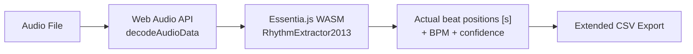

# 🎵 Beat Detection Module

This module uses **[Essentia.js (WASM)](https://mtg.github.io/essentia.js/docs/api/)**  to analyze audio and extract rhythmic information for DaVinci Resolve.

## How It Works

**Key difference from simple BPM-based grids:** Essentia's `RhythmExtractor2013` returns the **actual detected beat positions** in the audio signal (not evenly-spaced ticks derived from a single BPM value). This means beats are accurate even when the tempo fluctuates slightly.

> **Note:** This module operates in two modes:
> 1.  **Standalone**: For analyzing full tracks (accessible via the sidebar).
> 2.  **Embedded**: Integrated directly into **Stem Separation** for analyzing specific stems (Drums, Bass, etc.) with cached results.

## Feature Guide

### 🔀 Beat Algorithm

The **Beat Algorithm** selector lets you choose which Essentia.js beat-tracking strategy is used under the hood.

#### MultiFeature (Recommended)
Uses `BeatTrackerMultiFeature`, which fuses **five** low-level feature streams to identify beats:
- Complex spectral difference
- Energy flux
- Mel-band flux
- Beat emphasis
- Infogain

It returns a **confidence score** (0–5.32):
- **3.0+**: Strong, clear beat.
- **1.5–3.0**: Moderate.
- **<1.5**: Weak/Unreliable.

#### Degara (Fast)
Uses `BeatTrackerDegara`. Faster but returns no confidence score. Good for clean, simple rhythms.

---

### 📊 Additional Analysis

You can optionally enable:

1.  **🥁 Onset Detection**
    - Finds **transients** (drum hits, plucks, sharp attacks).
    - Best for percussive music or isolated stems.
    - **Note:** Can produce hundreds of markers on dense mixes.

2.  **🔊 Loudness Regions**
    - Identifies **high-energy sections** (choruses, drops).
    - Marks them with duration spans in Resolve.
    - Threshold default is 80% of peak loudness.

## Exporting for Resolve

The module exports an extended CSV format that supports:
- **beat** → Timeline marker (single frame)
- **onset** → Clip-level marker (audio track 1)
- **loudness** → Timeline marker (duration span)

Use the **Script Manager** to automatically load these into Resolve.
