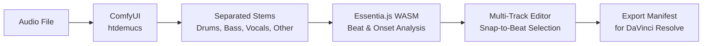

# 🎬 Video Assembler Module

The **Video Assembler** is the central hub for building rhythmically perfect music videos. It integrates stem separation, beat analysis, and multi-track editing into a single unified workflow — from raw audio to a finished DaVinci Resolve timeline.

---

## Prerequisites

1.  **ComfyUI Installed & Running**:
    -   Install [ComfyUI](https://github.com/comfyanonymous/ComfyUI) and run it locally on the default port: `http://127.0.0.1:8188`.
    -   Install the **Audio-Loading-Nodes** (or equivalent) custom nodes in ComfyUI to support the `LoadAudio` and `SaveAudio` nodes.

2.  **Workflow File**:
    -   The application uses a bundled workflow: `comfyui_workflows/Extract_Stems.json`.
    -   This workflow uses the `htdemucs` model (or similar) for stem separation.

---

## Workflow Overview

---

## Key Features

### 🎚️ Stem Separation (via ComfyUI)

Splits your audio into 4 separate stems (Drums, Bass, Vocals, Other) using a local ComfyUI installation.

-   **Auto-Detection**: The app checks for ComfyUI connectivity on launch (green "Connected" badge).
-   **Drag & Drop**: Drop an MP3, WAV, or FLAC file into the dropzone.
-   **Output**: Generated files are saved using the pattern `[OriginalFilename]_[StemType].mp3` in your project output folder.

### 🎵 Beat & Onset Analysis (Essentia.js)

Uses **[Essentia.js (WASM)](https://mtg.github.io/essentia.js/docs/api/)** to detect rhythmic features directly in the browser — no server required.

**Key advantage:** Essentia's `RhythmExtractor2013` returns **actual detected beat positions** (not evenly-spaced ticks from a single BPM), so beats stay accurate even when tempo fluctuates.

#### Beat Algorithms

| Algorithm | Engine | Speed | Confidence Score | Best For |
|---|---|---|---|---|
| **MultiFeature** (Recommended) | `BeatTrackerMultiFeature` | Standard | ✅ 0–5.32 | Complex rhythms, mixed signals |
| **Degara** (Fast) | `BeatTrackerDegara` | Fast | ❌ None | Clean, simple rhythms |

**MultiFeature** fuses five low-level feature streams: complex spectral difference, energy flux, mel-band flux, beat emphasis, and infogain.

#### Additional Analysis Options

-   **🥁 Onset Detection** — Finds transients (drum hits, plucks, sharp attacks). Best for percussive music or isolated stems.
-   **🔊 Loudness Regions** — Identifies high-energy sections (choruses, drops). Threshold default is 80% of peak loudness.

### 🎛️ Multi-Stem Visualization

-   **Persistent Stems**: View all separated tracks (Drums, Bass, Vocals, Other) simultaneously.
-   **Stem-Specific Beats**: Each stem displays its own analyzed markers, letting you align visuals to a specific instrument.
-   **Linked Zoom**: The zoom slider expands/contracts all waveforms in sync, maintaining horizontal alignment.
-   **Beat Source Selector**: Overlay beats from any specific stem onto the main track.
-   **Downbeat Highlighting**: Every 4th beat is visually thicker to help identify measures.

### 🎧 Advanced Playback Controls

-   **Main Track Controls**: Dedicated Play/Pause for the master audio.
-   **Individual Stem Auditing**: Each stem has its own Play/Pause buttons.
-   **Audit Mode (Play Stems)**: Plays all stems from 0s, mutes the main track, and dims/grayscales the main waveform.

### ✂️ Rhythmic Interaction

-   **Proximity Snap to Beat**: Region selection handles auto-snap to the nearest beat marker within a 10px threshold (scales with zoom level).
-   **Drag Selection**: Click and drag across any waveform (main or stem) to create a clip region.

### ⌨️ NLE Keyboard Shortcuts

Navigate and build your timeline without a mouse using industry-standard hotkeys:

| Key | Action |
|---|---|
| `Space` | Toggle play/pause |
| `L` | Play / fast forward (tap repeatedly for 2x, 4x, 8x) |
| `K` | Pause |
| `J` | Return to normal speed / skip backward 5s |
| `I` | Mark in-point at playhead |
| `O` | Mark out-point at playhead |
| `C` | Cut — add active selection as a new clip |

---

## Step-by-Step Workflow

1.  **Connect ComfyUI**: Start your ComfyUI server. The app shows a green "Connected" badge.
2.  **Import Audio**: Drag and drop your audio file into the dropzone. A project is auto-created.
3.  **Separate Stems**: Click **"Start Stem Separation"**. ComfyUI splits the track into Drums, Bass, Vocals, and Other.
4.  **Analyze Beats**: Click **"Analyze All Stems"** or analyze individual stems. Results are cached per-project.
5.  **Select Beat Source**: Choose which stem's beats to overlay on the main track (e.g., Drums for visual cuts).
6.  **Select Regions**: Drag regions on any waveform. Handles will snap to detected beats.
7.  **Generate Clips**: Click **"Generate Clip from Selection"**. Clips are tracked in a checkerboard pattern (alternating tracks).
8.  **Save**: Click **"Save to Project"** to persist clips and analysis data.
9.  **Export**: Click **"Export Manifest for Resolve"** to generate a `manifest.json`.
10. **Resolve Import**: Use the **Script Manager** module to run the Python assembly script, which builds the timeline in DaVinci Resolve automatically.

---

## Marker Legend

| Color | Type | Description |
|---|---|---|
| Indigo (thick) | Downbeat | Every 4th beat (measure start) |
| Indigo (thin) | Offbeat | Regular beats between downbeats |
| Orange | Onset | Transient / attack detection |
| Green | Loudness | High-energy region marker |
| Stem-specific | Per stem | Matches project colors (Drums: Red, Bass: Amber, etc.) |

---

## Exporting for Resolve

The module exports an extended CSV format that supports:
-   **beat** → Timeline marker (single frame)
-   **onset** → Clip-level marker (audio track 1)
-   **loudness** → Timeline marker (duration span)

Use the **Script Manager** to automatically load these into Resolve.

---

## Developer Architecture

-   **`src/modules/MusicVideoAssemblerModule.tsx`** — Main module integrating stem separation, beat analysis, and timeline editing.
-   **`src/types/assembler.ts`** — Shared interfaces (`VideoClip`, `TimelineRow`, `AudioMarker`, `StemData`).
-   **`src/utils/timelineUtils.ts`** — Pure helper functions for timeline manipulation, rendering, and time formatting.
-   **`src/components/ProjectTimelineTable.tsx`** — Decoupled timeline table with editing state.
-   **`src/components/CollapsibleCard.tsx`** — Expandable card UI component used for grouping configuration sections.
-   **`src/services/essentiaService.ts`** — Essentia.js WASM integration for beat, onset, and loudness analysis.
-   **`src/services/comfyService.ts`** — ComfyUI API communication for stem separation.

---

## Troubleshooting

-   **"ComfyUI: Disconnected"** — Ensure ComfyUI is running at `http://127.0.0.1:8188`. Check firewall settings.
-   **"Workflow file not found"** — Ensure `comfyui_workflows/Extract_Stems.json` exists in the application root/resources.
-   **Execution Error** — Check the ComfyUI console window for Python errors (missing models, missing custom nodes).
-   **Stems not visible after import** — Ensure stem audio files still exist at the paths stored in the project data.
