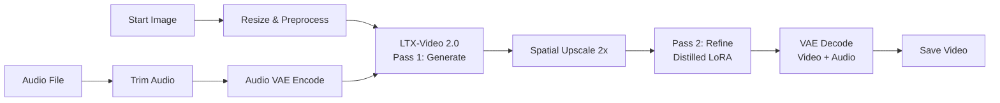

# 🎥 LTX-Video 2.0 — Image-to-Video Workflow

The **LTX-Video 2.0 I2V** workflow generates a video clip from a starting image, guided by a text prompt. It uses a two-pass sampling pipeline (initial generation → spatial upscale → refinement) with optional audio synthesis via the LTX Audio VAE.

**Workflow file:** `comfyui_workflows/video_ltx2_i2v.json`

---

## Workflow Overview



---

## Models Required

| Component | Filename | Node |
|---|---|---|
| **Checkpoint** | `ltx-2-19b-dev-fp8.safetensors` | `92:1` |
| **Text Encoder** | `gemma_3_12B_it_fp4_mixed.safetensors` | `92:60` |
| **Audio VAE** | `ltx-2-19b-dev-fp8.safetensors` | `92:48` |
| **Distilled LoRA** | `ltx-2-19b-distilled-lora-384.safetensors` | `92:68` |
| **Spatial Upscaler** | `ltx-2-spatial-upscaler-x2-1.0.safetensors` | `92:76` |

---

## API Parameter Reference

All parameters are modified by loading the workflow JSON, editing the relevant node's `inputs`, and POSTing to the ComfyUI `/prompt` endpoint:

```typescript
const workflow = JSON.parse(workflowJson);
workflow["98"].inputs.image = "my_start_image.png";  // example
await queuePrompt(workflow);
```

---

### 🖼️ Start Image

The source image that the video will animate from.

| Property | Node ID | Key | Default |
|---|---|---|---|
| Image filename | `98` | `inputs.image` | `"Image_fx(21).jpg"` |

```json
"98": {
  "inputs": {
    "image": "my_image.png"
  },
  "class_type": "LoadImage"
}
```

> [!NOTE]
> The image must exist in ComfyUI's `input/` directory. Upload it via the ComfyUI `/upload/image` endpoint first, or place it there manually.

The image is automatically resized to **1280×720** by node `102`:

| Property | Node ID | Key | Default |
|---|---|---|---|
| Width | `102` | `inputs.resize_type.width` | `1280` |
| Height | `102` | `inputs.resize_type.height` | `720` |

---

### ✏️ Prompt Text

Controls what the generated video depicts. There is a **positive prompt** (what to generate) and a **negative prompt** (what to avoid).

#### Positive Prompt

| Property | Node ID | Key |
|---|---|---|
| Prompt text | `92:3` | `inputs.text` |

```json
"92:3": {
  "inputs": {
    "text": "A sweeping cinematic shot of a mountain landscape at sunset..."
  },
  "class_type": "CLIPTextEncode"
}
```

#### Negative Prompt

| Property | Node ID | Key | Default |
|---|---|---|---|
| Negative text | `92:4` | `inputs.text` | `"blurry, low quality, still frame, frames, watermark, overlay, titles, has blurbox, has subtitles"` |

```json
"92:4": {
  "inputs": {
    "text": "blurry, low quality, watermark"
  },
  "class_type": "CLIPTextEncode"
}
```

---

### 🎞️ FPS (Frames Per Second)

The frame rate appears in **three nodes** and should be kept consistent across all of them:

| Property | Node ID | Key | Default |
|---|---|---|---|
| Conditioning FPS | `92:22` | `inputs.frame_rate` | `25` |
| Latent Audio FPS | `92:51` | `inputs.frame_rate` | `25` |
| Output Video FPS | `92:97` | `inputs.fps` | `25` |

```typescript
// Set all three to match
workflow["92:22"].inputs.frame_rate = 30;
workflow["92:51"].inputs.frame_rate = 30;
workflow["92:97"].inputs.fps = 30;
```

> [!IMPORTANT]
> All three FPS values **must match**. Mismatched values will cause audio/video desync or generation errors.

---

### 🔢 Number of Frames

Controls how many frames (and therefore the duration) of the generated video.

| Property | Node ID | Key | Default |
|---|---|---|---|
| Frame count | `92:62` | `inputs.value` | `81` |

```json
"92:62": {
  "inputs": {
    "value": 81
  },
  "class_type": "PrimitiveInt"
}
```

**Duration formula:** `frames / fps = seconds`

| Frames | FPS | Duration |
|---|---|---|
| 81 | 25 | ~3.24s |
| 121 | 25 | ~4.84s |
| 81 | 30 | ~2.70s |
| 161 | 25 | ~6.44s |

> [!NOTE]  
> LTX-Video 2.0 works with frame counts following the formula `(n × 8) + 1`.  
> Valid values include: 9, 17, 25, 33, 41, 49, 57, 65, 73, **81**, 89, 97, 105, 113, 121, etc.  
>Higher frame counts require more VRAM.

---

### 🔊 Audio Source

This workflow uses a **LoadAudio** node to intake an external audio file, trims its duration to match the video, and encodes it using the **LTXV Audio VAE Encode** node. The synthesized video will match the pacing and characteristics of the provided audio.

| Property | Node ID | Key | Default |
|---|---|---|---|
| Audio filename | `92:113` | `inputs.audio` | `"Bob Marly-Get Up, Stand Up_Vocals.mp3"` |
| Audio VAE Encode | `92:117` | `inputs.audio` | Linked to TrimAudioDuration (`92:115`) |
| Audio Start Time (s) | `92:115` | `inputs.start_index` | `20` |
| Audio Duration (s) | `92:115` | `inputs.duration` | `3` |

> [!TIP]  
> The audio is loaded from an external file in ComfyUI's input directory. You can specify the file name by modifying the `inputs.audio` property on node `92:113`. The duration and start time can be adjusted in the **Trim Audio Duration** node (`92:115`). For perfect synchronization, the audio `duration` should match your calculated video duration (`frames / fps`).

#### Audio VAE Model

The Audio VAE model is loaded by node `92:48`:

| Property | Node ID | Key | Default |
|---|---|---|---|
| Checkpoint name | `92:48` | `inputs.ckpt_name` | `"ltx-2-19b-dev-fp8.safetensors"` |

---

### 📂 Output File Location

The saved video output path and format.

| Property | Node ID | Key | Default |
|---|---|---|---|
| Filename prefix | `75` | `inputs.filename_prefix` | `"video/LTX_2.0_i2v"` |
| Format | `75` | `inputs.format` | `"auto"` |
| Codec | `75` | `inputs.codec` | `"auto"` |

```json
"75": {
  "inputs": {
    "filename_prefix": "video/my_project/clip_001",
    "format": "auto",
    "codec": "auto"
  },
  "class_type": "SaveVideo"
}
```

> [!NOTE]  
> The `filename_prefix` is relative to ComfyUI's `output/` directory. A counter suffix is appended automatically (e.g., `clip_001_00001.mp4`). Subdirectories are created automatically.

---

## Full API Example

```typescript
import { queuePrompt } from './services/comfyService';
import workflowJson from '../comfyui_workflows/video_ltx2_i2v.json';

// Deep clone to avoid mutating the template
const workflow = JSON.parse(JSON.stringify(workflowJson));

// 1. Set start image
workflow["98"].inputs.image = "my_photo.jpg";

// 2. Set prompt
workflow["92:3"].inputs.text = "A dramatic zoom into a glowing crystal...";
workflow["92:4"].inputs.text = "blurry, watermark, low quality";

// 3. Set FPS (all three must match)
const fps = 25;
workflow["92:22"].inputs.frame_rate = fps;
workflow["92:51"].inputs.frame_rate = fps;
workflow["92:97"].inputs.fps = fps;

// 4. Set number of frames (must be (n*8)+1)
workflow["92:62"].inputs.value = 121; // ~4.84s at 25fps

// 5. Set output location
workflow["75"].inputs.filename_prefix = "video/my_project/scene_01";

// 6. Set audio file
workflow["92:113"].inputs.audio = "my_audio.mp3";

// 7. Queue the prompt
const result = await queuePrompt(workflow);
console.log('Queued:', result?.prompt_id);
```

---

## Advanced Sampling Parameters

These parameters control generation quality and are typically left at defaults:

| Parameter | Node ID | Key | Default | Description |
|---|---|---|---|---|
| Steps (Pass 1) | `92:9` | `inputs.steps` | `20` | Denoising steps for initial generation |
| CFG (Pass 1) | `92:47` | `inputs.cfg` | `4` | Classifier-Free Guidance scale |
| CFG (Pass 2) | `92:82` | `inputs.cfg` | `1` | Refinement guidance (lower = more faithful) |
| Seed (Pass 1) | `92:11` | `inputs.noise_seed` | `10` | Random seed for reproducibility |
| Seed (Pass 2) | `92:67` | `inputs.noise_seed` | `0` | Random seed for refinement pass |
| Image Compression | `92:99` | `inputs.img_compression` | `33` | Start image conditioning strength |
| Image Resize | `102` | `inputs.resize_type.width/height` | `1280 × 720` | Input image dimensions |

---

## VRAM Management

ComfyUI executes workflows one by one and automatically handles loading/unloading models from VRAM as needed between different jobs. 

However, if you want to explicitly clear VRAM and system memory between large batches or if you intend to run other heavy applications, you can trigger ComfyUI's `/free` endpoint:

```typescript
// Example: POST to /free to unload models
await fetch('http://127.0.0.1:8188/free', {
    method: 'POST',
    headers: { 'Content-Type': 'application/json' },
    body: JSON.stringify({ unload_models: true, free_memory: true })
});
```

*(This functionality is available via the "🧹 Clear VRAM" button on the LTX Test Page.)*

---

## Troubleshooting

-   **"ComfyUI: Disconnected"** — Ensure ComfyUI is running at `http://127.0.0.1:8188`.
-   **Missing model errors** — Verify all 5 model files are in the correct ComfyUI model directories (`models/checkpoints/`, `models/loras/`, `models/upscale_models/`, `models/text_encoders/`).
-   **VRAM errors** — Reduce frame count or image resolution. The `fp8` checkpoint helps with VRAM usage.
-   **Audio/video desync** — Ensure all three FPS values match (`92:22`, `92:51`, `92:97`).
-   **Invalid frame count** — Use values following `(n × 8) + 1` (e.g.,  9, 17, 25, 33, 41, 49, 57, 65, 73, **81**, 89, 97, 105, 113, 121, etc.  ).
