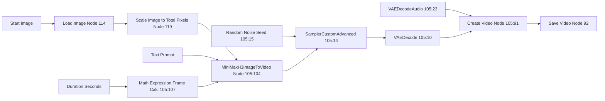

# 🎥 MiniMax H3 — Image-to-Video Workflow

The **MiniMax H3 Image-to-Video** workflow generates a video clip from a starting reference image (or images), guided by a highly structured text prompt. Unlike LTX which was heavily reliant on constraint math for alignment, MiniMax H3 uses dynamic mathematical expression calculations and a unified multimodal generation pass.

**Workflow file:** `comfyui_workflows/minimax_image_to_video_api.json`

---

## Workflow Overview

---

## Models Required

| Component | Filename | Node |
|---|---|---|
| **UNET Model** | `minimax_h3_fl2va_pruned_int8_convrot.safetensors` | `105:6` |
| **CLIP / Text Encoder** | `qwen3vl_32b_minimax_h3_nvfp4_awq.safetensors` | `105:13` |
| **Video VAE** | `minimax_h3_video_vae_fp16.safetensors` | `105:11` |
| **Audio VAE** | `minimax_h3_audio_vae_fp32.safetensors` | `105:24` |

---

## Node Configuration & API Injection Points

The application intercepts this workflow via the ComfyUI API and automatically injects runtime variables. 

### 1. Image Injection (Node 114)
The initial reference image for the I2VA (Image to Video with Audio) mode is injected here.
- `inputs.image` = `target_image.png`

### 2. Prompt Injection (Node 105:104)
MiniMax H3 requires a highly specific prompt structure containing:
- `integrated_multimodal_description:`
- `overall_soundscape:`
- `non_diegetic_music:`
This is injected dynamically at `inputs.prompt`.

### 3. Duration & Frame Math (Node 105:111 -> 105:107)
MiniMax H3 requires frame counts to follow a `17n + 5` constraint (e.g., 22, 39, 56, etc.). 
- The target duration (in seconds) is passed to a `PrimitiveFloat` node (`105:111`).
- Node `105:107` evaluates the expression: 
  `max(5, round(a * 24)) + (5 - (max(5, round(a * 24)) % 17)) % 17`
- This forces the final frame count to legally match the `17n + 5` rule.

### 4. Generation Seed (Node 105:15)
To ensure random variance on each run:
- `inputs.noise_seed` = `random_integer`

### 5. Final Output Container (Node 105:91 & 92)
- Node `105:91` (Create Video) combines the VAE decoded video frames and audio track. `inputs.fps` is set dynamically.
- Node `92` (Save Video) writes the output file with the prefix `video/MiniMax_H3`.

---

## Best Practices for H3 Prompts
When bypassing the app's LLM generation, ensure your manual prompts adhere to the three required blocks and use precise chronological camera/action descriptors without any metadata. Always verify durations match the requested alignment constraints.
